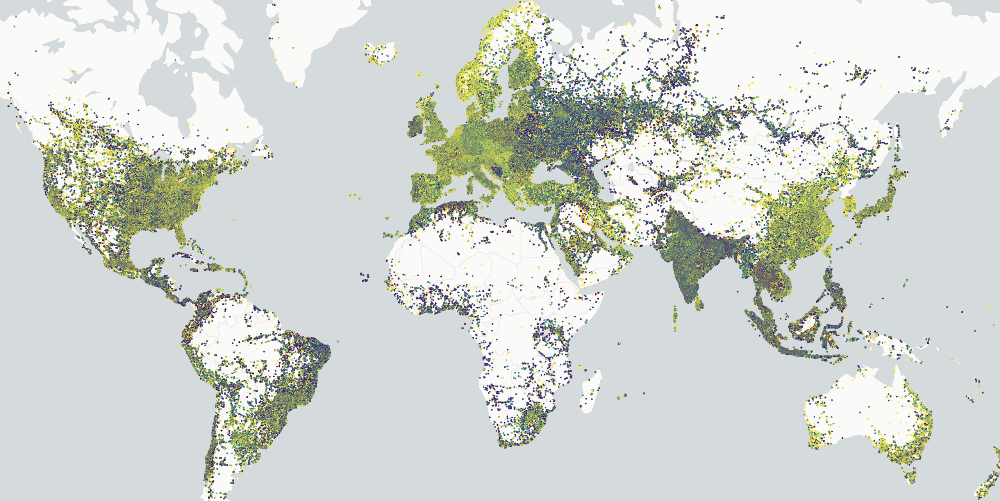

# @geoarrow/deck.gl-layers

The easiest, most efficient way to render large geospatial datasets in [deck.gl](https://deck.gl), via [GeoArrow](https://geoarrow.org).



<p style="text-align:center">3.2 million points rendered with a <code>GeoArrowScatterplotLayer</code>.</p>

## Features

- **Fast**: copies binary buffers directly from an [Arrow JS](https://www.npmjs.com/package/apache-arrow) [`Table`](https://arrow.apache.org/docs/js/classes/Arrow_dom.Table.html) object to the GPU using [deck.gl's binary data interface](https://deck.gl/docs/developer-guide/performance#supply-attributes-directly).
- **Memory-efficient**: no intermediate data representation and no garbage-collector overhead.
- **Full layer customization**: Use the same layer properties as in the upstream deck.gl layer documentation. Any _accessor_ (layer property prefixed with `get*`) can be passed an Arrow [`Vector`](https://arrow.apache.org/docs/js/classes/Arrow_dom.Vector.html).
- **Input validation**. Validation can be turned off via the `_validate` property on most layer types.
- **Multi-threaded polygon triangulation**. When rendering polygon layers, a process called [polygon triangulation](https://en.wikipedia.org/wiki/Polygon_triangulation) must happen on the CPU before data can be copied to the GPU. Ordinarily, this can block the main thread for several seconds, but the `GeoArrowSolidPolygonLayer` will perform this process off the main thread, on up to 8 web workers.
- **Progressive rendering support**. For streaming-capable data formats like Arrow IPC and Parquet, you can render a GeoArrow layer per chunk as the data loads.

## Examples

Standalone examples exist in the [`examples/`](examples/) directory. Create an issue if you have trouble running them.

More hosted examples on Observable are planned.

## Data Loading

To create deck.gl layers using this library, you need to first get GeoArrow-formatted data into the browser, discussed below.

[OGR/GDAL](https://gdal.org/) is useful for converting among data formats on the backend, and it includes both [GeoArrow](https://gdal.org/drivers/vector/arrow.html#vector-arrow) and [GeoParquet](https://gdal.org/drivers/vector/parquet.html) drivers. Pass `-lco GEOMETRY_ENCODING=GEOARROW` when converting to Arrow or Parquet files in order to store geometries in a GeoArrow-native geometry column.

### Arrow IPC

If you already have Arrow IPC files (also called Feather files) with a GeoArrow geometry column, you can use [`apache-arrow`](https://www.npmjs.com/package/apache-arrow) to load those files.

```ts
import { tableFromIPC } from "apache-arrow";
import { GeoArrowScatterplotLayer } from "@geoarrow/deck.gl-layers";

const resp = await fetch("url/to/file.arrow");
const jsTable = await tableFromIPC(resp);
const deckLayer = new GeoArrowScatterplotLayer({
  data: jsTable,
  /// Replace with the correct geometry column name
  getPosition: jsTable.getChild("geometry")!,
});
```

Note those IPC files must be saved **uncompressed** (at least not internally compressed). As of v14, Arrow JS does not currently support loading IPC files with internal compression.

### Parquet

If you have a Parquet file where the geometry column is stored as _GeoArrow_ encoding (i.e. not as a binary column with WKB-encoded geometries), you can use the stable `parquet-wasm` library to load those files.

```ts
import { readParquet } from "parquet-wasm"
import { tableFromIPC } from "apache-arrow";
import { GeoArrowScatterplotLayer } from "@geoarrow/deck.gl-layers";

const resp = await fetch("url/to/file.parquet");
const arrayBuffer = await resp.arrayBuffer();
const wasmTable = readParquet(new Uint8Array(arrayBuffer));
const jsTable = tableFromIPC(wasmTable.intoIPCStream());
const deckLayer = new GeoArrowScatterplotLayer({
  data: jsTable,
  /// Replace with the correct geometry column name
  getPosition: jsTable.getChild("geometry")!,
});
```

See below for instructions to load GeoParquet 1.0 files, which have WKB-encoded geometries that need to be decoded before they can be used with `@geoarrow/deck.gl-layers`.

### GeoParquet

An initial version of the [`@geoarrow/geoparquet-wasm`](https://www.npmjs.com/package/@geoarrow/geoparquet-wasm) library is published, which reads a GeoParquet file to GeoArrow memory.

```ts
import { readGeoParquet } from "@geoarrow/geoparquet-wasm";
import { tableFromIPC } from "apache-arrow";
import { GeoArrowScatterplotLayer } from "@geoarrow/deck.gl-layers";

const resp = await fetch("url/to/file.parquet");
const arrayBuffer = await resp.arrayBuffer();
const wasmTable = readGeoParquet(new Uint8Array(arrayBuffer));
const jsTable = tableFromIPC(wasmTable.intoTable().intoIPCStream());
const deckLayer = new GeoArrowScatterplotLayer({
  data: jsTable,
  /// Replace with the correct geometry column name
  getPosition: jsTable.getChild("geometry")!,
});
```

If you hit a bug with `@geoarrow/geoparquet-wasm`, please create a reproducible bug report [here](https://github.com/geoarrow/geoarrow-rs/issues/new).

### FlatGeobuf

An initial version of the [`@geoarrow/flatgeobuf-wasm`](https://www.npmjs.com/package/@geoarrow/flatgeobuf-wasm) library is published, which reads a FlatGeobuf file to GeoArrow memory. As of version 0.2.0-beta.1, this library does not yet support remote files, and expects the full FlatGeobuf file to exist in memory.

```ts
import { readFlatGeobuf } from "@geoarrow/flatgeobuf-wasm";
import { tableFromIPC } from "apache-arrow";
import { GeoArrowScatterplotLayer } from "@geoarrow/deck.gl-layers";

const resp = await fetch("url/to/file.fgb");
const arrayBuffer = await resp.arrayBuffer();
const wasmTable = readFlatGeobuf(new Uint8Array(arrayBuffer));
const jsTable = tableFromIPC(wasmTable.intoTable().intoIPCStream());
const deckLayer = new GeoArrowScatterplotLayer({
  data: jsTable,
  /// Replace with the correct geometry column name
  getPosition: jsTable.getChild("geometry")!,
});
```

If you hit a bug with `@geoarrow/flatgeobuf-wasm`, please create a reproducible bug report [here](https://github.com/geoarrow/geoarrow-rs/issues/new).
